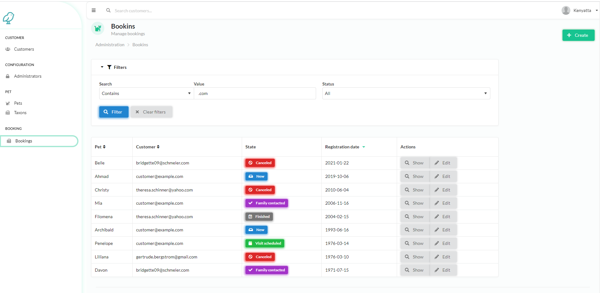
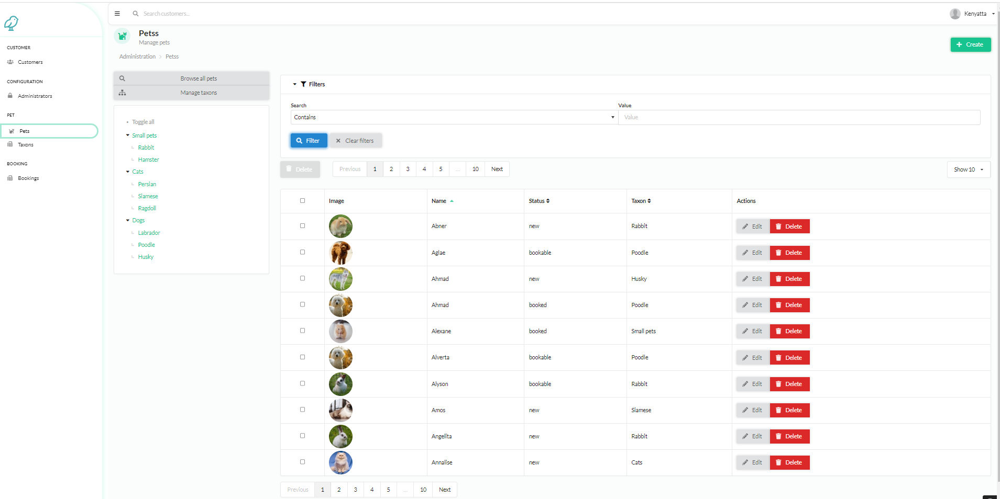

Package based on [Monofony/Demo](https://github.com/Monofony/Demo) designed to be installed on [Monofony/Skeleton](https://github.com/Monofony/Skeleton) for a quick demo of the backend





Installation
------------
If you have Composer installed globally.

```bash
composer require allekslar/monofony-demo-backend
```

Configure the plugin:

Copy the routing file monofony_demo_backend.yaml from the package folder ./config/copy/routes/ to your config/routes/

or run the command

```bash
    composer run-script post-install -d ./vendor/allekslar/monofony-demo-backend
```
Extend config files:

Add SyliusTaxonomyBundle and SyliusLocaleBundle to config/bundles.php.

```bash
// config/bundles.php

    Sylius\Bundle\TaxonomyBundle\SyliusTaxonomyBundle::class => ['all' => true],
    Sylius\Bundle\LocaleBundle\SyliusLocaleBundle::class => ['all' => true],
```
Finish the installation by updating the database schema and installing assets and fixtures:

```bash
    bin/console doctrine:migrations:diff
    bin/console doctrine:migrations:migrate
    bin/console assets:install
    bin/console doctrine:fixtures:load -n
```

Admin

Username: admin@example.com
Password: admin


Run before uninstall:

```bash
    composer run-script remove -d ./vendor/allekslar/monofony-demo-backend
```

License
-------

This bundle is under the MIT license. See the complete license [in the bundle](LICENSE.md)

About
-----